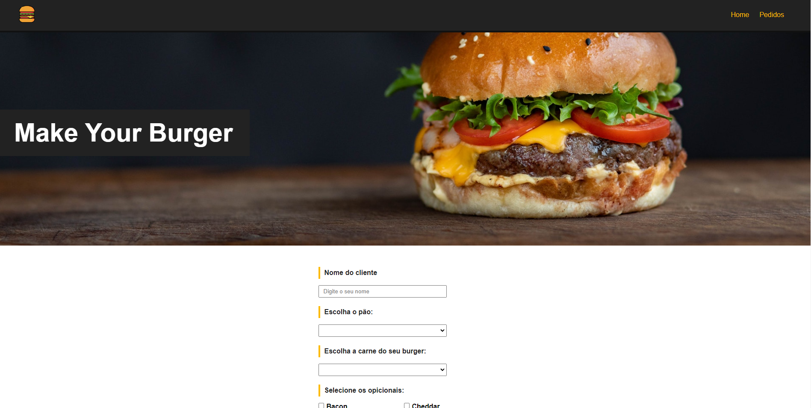

<h2 align="center">
  Make Your Burger
</h2>

<p align="center">
 <a href="#-sobre-o-projeto">Sobre</a> •
 <a href="#-tecnologias">Tecnologias</a> •
 <a href="#-aplicação">Aplicação</a> • 
 <a href="#-como-executar">Executar</a> 
</p>

## 💻 Sobre o projeto

Aplicação desenvolvida em um curso de Vue.js feito um esquema tipo de CRUD mas para montar um hamburger, conseguindo criar o pedido, alterar e até excluir após pronto.

---

## 🛠 Tecnologias

As seguintes ferramentas foram usadas na construção do projeto:

-   **Vue.js**

## 🚀 Aplicação

<p align="center">
  
</p>

<p align="center">
  
</p>
---

## 🛠 COMO EXECUTAR

```

# Clone este repositório
$ git clone git@github.com:KaiqueBM/Make-Your-Burger.git

# Vá para a pasta do projeto
$ cd make-your-burger

# Instale as dependencias
$ npm run install

# Execute o back end
$ npm run backend

# Execute o front end
$ npm run serve

# Vai abrir no localhost com a porta 8080 a aplicação.

```
